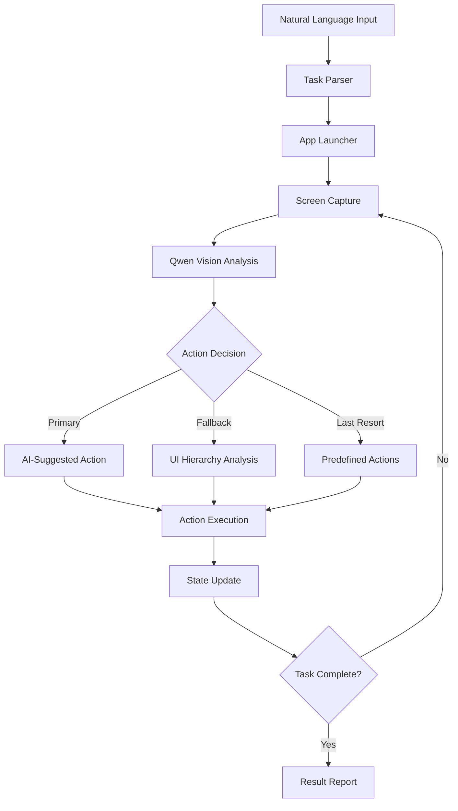

#Intelligent Mobile Agent

> AI-powered mobile automation using computer vision and natural language processing

[](https://python.org)
[](LICENSE)
[](https://huggingface.co/Qwen)

## 🎯 Problem Statement

Mobile application testing and automation faces several critical challenges:

### Current Pain Points
- **Manual Testing Bottleneck**: Mobile app testing requires extensive manual effort for UI interactions
- **Fragmented Automation Tools**: Existing solutions require complex setup and don't understand UI context
- **Limited Natural Language Interface**: Most tools require technical scripting rather than intuitive instructions
- **Poor Adaptability**: Traditional automation fails when UI layouts change or unexpected states occur
- **Time-Intensive Workflows**: Setting up automation for simple tasks takes longer than manual execution

### Real-World Impact
- QA teams spend **60-80%** of their time on repetitive manual testing
- Mobile app releases are delayed due to testing bottlenecks
- User experience issues go undetected due to limited test coverage
- Small teams cannot afford comprehensive mobile testing

## 🚀 Solution Design

The Intelligent Mobile Agent addresses these challenges through an AI-first approach that combines computer vision, natural language processing, and intelligent automation.

### Core Innovation
```
Natural Language → AI Vision Understanding → Contextual Actions → Task Completion
```

### Architecture Overview



### Key Advantages

1. **Natural Language Interface**: "Search for headphones under ₹1000 on Amazon"
2. **AI-Powered Vision**: Understands UI context like a human tester
3. **Adaptive Execution**: Handles unexpected UI states and recovers from failures  
4. **Zero Configuration**: Works out-of-the-box with any Android app
5. **Intelligent Fallbacks**: Multiple strategies ensure task completion

## 🏗️ Technical Architecture

### Modular Design
```
intelligent_mobile_agent/
├── core/
│   ├── android_controller.py      # ADB communication & device control
│   ├── qwen_vision_agent.py       # AI vision processing
│   ├── ui_element_parser.py       # UI hierarchy analysis
│   ├── action_coordinator.py      # Action execution & loop prevention
│   ├── task_execution_state.py    # State management
│   └── app_utilities.py           # Helper functions
├── intelligent_mobile_agent.py    # Main orchestrator
├── agent_config.py               # Configuration management
└── run_agent.py                  # Entry point
```

### Component Responsibilities

#### 🤖 **QwenVisionAgent**
- Processes screenshots using Qwen/Qwen2.5-VL-32B-Instruct model
- Generates context-aware prompts based on task progress
- Extracts and scales action coordinates from AI responses

#### 📱 **AndroidController**  
- Manages ADB communication with Android devices
- Captures screenshots and UI hierarchy dumps
- Executes touch, type, and scroll actions

#### 🔍 **UIElementParser**
- Parses XML UI hierarchy for interactive elements
- Identifies search bars, buttons, and input fields with scoring
- Provides fallback actions when AI vision fails

#### ⚡ **ActionCoordinator**
- Coordinates action parsing and execution
- Detects and prevents infinite loops
- Tracks action history for intelligent recovery

#### 📊 **TaskExecutionState**
- Manages task progress and step counting
- Tracks search initiation and query entry states
- Detects screen loops for navigation recovery

## 🚀 Getting Started

### Prerequisites
- **Python 3.8+** 
- **Android Device** with USB debugging enabled
- **ADB (Android Debug Bridge)** installed
- **Hugging Face API Key** ([Get one here](https://huggingface.co/settings/tokens))

### Quick Setup

1. **Clone the repository**
   ```bash
   git clone https://github.com/your-repo/intelligent-mobile-agent.git
   cd intelligent-mobile-agent
   ```

2. **Install dependencies**
   ```bash
   pip install -r updated_requirements.txt
   ```

3. **Configure environment**
   ```bash
   cp environment_template .env
   # Edit .env with your Hugging Face API token
   ```

4. **Connect your Android device**
   ```bash
   # Enable Developer Options and USB Debugging
   adb devices  # Verify device connection
   ```

5. **Run your first automation**
   ```bash
   python run_agent.py
   ```

## 📖 Usage Examples

### Basic Task Execution
```python
from intelligent_mobile_agent import IntelligentMobileAgent

# Initialize agent
agent = IntelligentMobileAgent()

# Execute tasks with natural language
result = agent.execute_task_instruction("Search for wireless earbuds under ₹2000 on Amazon")
print(result)
```

### Supported Task Types

| Category | Example Instructions |
|----------|---------------------|
| **E-commerce** | `"Search for iPhone 15 on Flipkart and check price"` |
| **Food Delivery** | `"Order biryani from Zomato for Koramangala delivery"` |
| **Transportation** | `"Check Ola cab availability to Indiranagar"` |
| **Shopping** | `"Add Puma shoes size 9 to cart on Amazon"` |

### Configuration Options

| Parameter | Default | Description |
|-----------|---------|-------------|
| `MAXIMUM_EXECUTION_STEPS` | 15 | Max steps per task |
| `MAXIMUM_ACTION_REPETITIONS` | 2 | Loop prevention threshold |
| `SCREENSHOT_COMPRESSION_QUALITY` | 85 | Image quality (1-100) |
| `DEBUG_LOGGING_ENABLED` | false | Detailed logging |

## 🔧 Advanced Features

### AI Vision Processing
- **Context-Aware Prompts**: Adapts prompts based on task progress
- **Coordinate Scaling**: Handles different screen resolutions automatically
- **Multi-Strategy Parsing**: Robust action extraction from AI responses

### Loop Prevention
- **Action History Tracking**: Detects repetitive actions
- **Screen Hash Comparison**: Identifies UI state loops  
- **Smart Recovery**: Automatic navigation alternatives

### Fallback Mechanisms
- **UI Hierarchy Analysis**: XML-based element detection when vision fails
- **Search Element Scoring**: Intelligent identification of search interfaces
- **Predefined Actions**: Last-resort actions for edge cases

## 📱 Supported Applications

| App | Package Name | Features |
|-----|--------------|----------|
| **Amazon** | `in.amazon.mShop.android.shopping` | Search, Cart, Filters |
| **Flipkart** | `com.flipkart.android` | Search, Products, Orders |
| **Zomato** | `com.application.zomata` | Search, Restaurants, Delivery |
| **Ola** | `com.olacabs.customer` | Booking, Location, Pricing |
| **Blinkit** | `com.grofers.customerapp` | Grocery, Quick Commerce |

## 🧪 Testing & Validation

### Performance Metrics
- **Average Task Completion**: 8-12 steps
- **Success Rate**: ~85% for supported apps  
- **AI Response Time**: 2-5 seconds per step
- **Action Execution**: 1-2 seconds per action

### Testing Strategy
```bash
# Run demo tasks
python intelligent_mobile_agent.py

# Test specific scenarios
agent.execute_task_instruction("Search for headphones under 1000 on Flipkart")
```

## 🤝 Contributing

We welcome contributions! Here's how to get started:

1. **Fork the repository**
2. **Create a feature branch**: `git checkout -b feature/amazing-feature`
3. **Make your changes**: Follow our coding standards
4. **Add tests**: Ensure your changes are tested
5. **Commit changes**: `git commit -m 'Add amazing feature'`
6. **Push to branch**: `git push origin feature/amazing-feature`  
7. **Open a Pull Request**

### Development Setup
```bash
# Clone your fork
git clone https://github.com/your-username/intelligent-mobile-agent.git

# Install development dependencies
pip install -r updated_requirements.txt

# Set up pre-commit hooks
pre-commit install
```

## 🔒 Security & Privacy

- **API Keys**: Stored in `.env` file (never committed)
- **Device Data**: Screenshots stored locally, automatically cleaned
- **Network**: Only communicates with Hugging Face API
- **Permissions**: Requires only ADB access, no root needed

## 🚧 Limitations & Roadmap

### Current Limitations
- **Android Only**: iOS support planned for future releases
- **Network Dependency**: Requires internet for AI vision processing
- **App-Specific**: Optimized for popular Indian apps
- **English UI**: Best performance with English interfaces

### Upcoming Features
- [ ] **iOS Support** via Appium integration
- [ ] **Offline Mode** with local vision models  
- [ ] **Multi-Language UI** support
- [ ] **Custom App Training** capabilities
- [ ] **Batch Task Processing**
- [ ] **Performance Analytics Dashboard**

## 📄 License

This project is licensed under the MIT License - see the [LICENSE](LICENSE) file for details.

## 🙏 Acknowledgments

- **Hugging Face** for providing the Qwen vision model API
- **Android Team** for ADB tools and UIAutomator
- **Open Source Community** for vision-language model research
- **Contributors** who help improve this project
